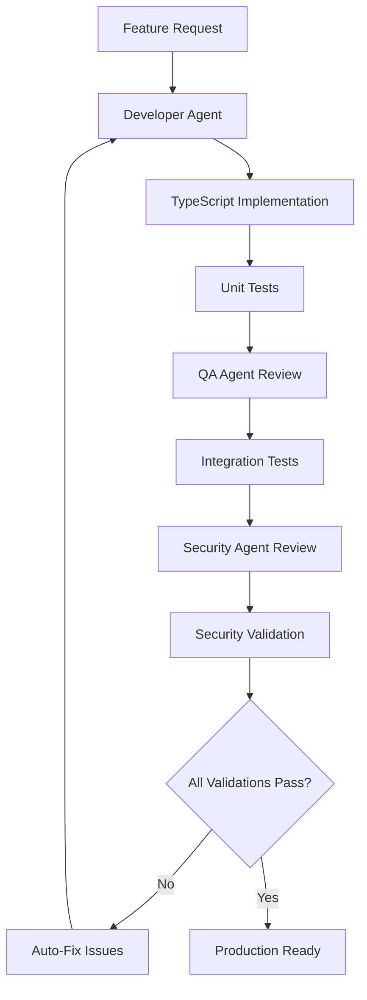
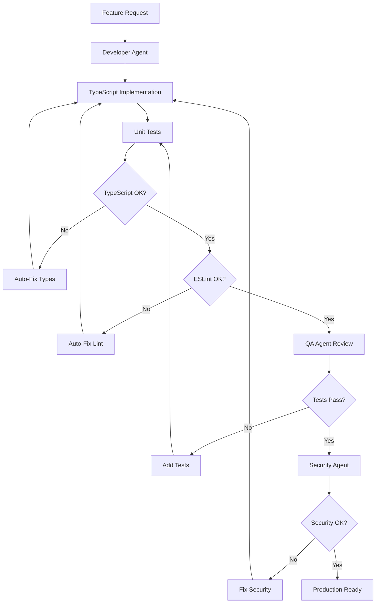

# aipex.sh - Enterprise AI Workflow - Complete Usage Guide

## 🚀 **How to Use**

### **1. Quick Setup**
```bash
# In your project directory
curl -sSL https://raw.githubusercontent.com/dknell/aipex.sh/refs/heads/main/aipex.sh | bash
# Or download and run the setup script
```

### **2. Feature Development Workflow**
```bash
# 1. Edit your feature requirements
vim INITIAL.md

# 2. Generate comprehensive PRP with multi-agent context
/generate-prp INITIAL.md

# 3. Execute with autonomous validation
/execute-prp PRPs/generated/your-feature-name.md

# The system automatically:
# ✅ Implements TypeScript code with strict typing
# ✅ Creates comprehensive unit and integration tests
# ✅ Validates ESLint compliance with auto-fixing
# ✅ Runs security scans and input validation
# ✅ Executes browser tests across multiple devices
# ✅ Generates documentation and provides multi-agent feedback
```

### **3. Manual Validation Commands**
```bash
# Individual validation commands (run automatically during execution)
/validate-ts        # TypeScript compilation and type checking
/validate-lint      # ESLint validation with auto-fixing
/run-tests         # Full test suite with coverage
/security-check    # Security scanning and validation
/qa-review         # QA agent comprehensive review
```

## 🏗️ **Architecture Deep Dive**

### **Multi-Agent Communication Flow**


### **Validation Gate System**

The workflow implements a multi-agent validation system with continuous feedback loops:



**Current Validation Gates** (implemented in Claude commands):
1. **TypeScript Compilation**: `tsc --noEmit --strict` 
2. **ESLint Validation**: `eslint src/ --ext .ts,.tsx --fix`
3. **Test Coverage**: `jest --coverage` (≥80% required)
4. **Security Scan**: `npm audit --audit-level=high`
5. **Performance Check**: Load time and bundle size validation

**Future Validation Gates** (planned for Phase 2):
```typescript
// Conceptual interface for future structured validation system
interface ValidationGate {
  name: string;
  agent: 'developer' | 'qa' | 'security';
  requirements: ValidationRequirement[];
  autoFixable: boolean;
  criticalFailure: boolean;
}
```

## 📋 **Example INITIAL.md Template**

```markdown
## FEATURE:
Build a user authentication system with JWT tokens, password reset functionality, and role-based access control. The system should integrate with our existing React app and provide secure session management.

## EXAMPLES:
- examples/typescript/component-pattern.tsx - Follow this pattern for React components
- examples/security/input-validation-pattern.ts - Use these validation patterns
- examples/testing/component-test-pattern.test.tsx - Follow this testing structure

## DOCUMENTATION:
- JWT Library: https://github.com/auth0/node-jsonwebtoken
- React Hook Form: https://react-hook-form.com/
- Zod Validation: https://zod.dev/

## TYPESCRIPT REQUIREMENTS:
```typescript
interface User {
  readonly id: string;
  readonly email: string;
  readonly name: string;
  readonly role: UserRole;
  readonly createdAt: Date;
  readonly lastLoginAt: Date | null;
}

type UserRole = 'admin' | 'user' | 'guest';

interface AuthContext {
  readonly user: User | null;
  readonly isAuthenticated: boolean;
  readonly isLoading: boolean;
  readonly error: string | null;
}
```

## TESTING REQUIREMENTS:
- Unit test coverage: minimum 85%
- Integration tests for all authentication flows
- E2E tests for login/logout/password reset
- Performance: login response < 500ms
- Security: test against common attack vectors

## SECURITY CONSIDERATIONS:
- JWT tokens with 1-hour expiration
- Refresh token rotation
- Rate limiting: 5 login attempts per minute
- Password requirements: 12 chars, special chars, numbers
- Input sanitization for all form fields
- HTTPS only for authentication endpoints

## OTHER CONSIDERATIONS:
- Integrate with existing Redux store
- Maintain backward compatibility with current user sessions
- Add proper loading states and error handling
- Ensure accessibility compliance (WCAG 2.1 AA)
```

## 🔧 **Configuration Examples**

### **Custom ESLint Rules**
```javascript
// .eslintrc.js - Add custom enterprise rules
module.exports = {
  // ... existing config
  rules: {
    // Custom security rules
    'no-eval': 'error',
    'no-implied-eval': 'error',
    'no-new-func': 'error',
    
    // TypeScript strict rules
    '@typescript-eslint/no-any': 'error',
    '@typescript-eslint/explicit-function-return-type': 'warn',
    '@typescript-eslint/prefer-readonly': 'error',
    
    // React best practices
    'react-hooks/exhaustive-deps': 'error',
    'react/no-array-index-key': 'error',
    
    // Import organization
    'import/order': ['error', {
      'groups': ['builtin', 'external', 'internal'],
      'newlines-between': 'always',
    }],
  },
};
```

### **Custom Jest Configuration**
```javascript
// jest.config.js - Enhanced testing setup
module.exports = {
  // ... existing config
  coverageThreshold: {
    global: {
      branches: 80,
      functions: 80,
      lines: 85,
      statements: 85,
    },
    // Per-file thresholds
    './src/components/': {
      branches: 90,
      functions: 90,
      lines: 95,
      statements: 95,
    },
  },
  setupFilesAfterEnv: [
    '<rootDir>/tests/setup.ts',
    '<rootDir>/tests/security-setup.ts',
  ],
};
```

### **Security Configuration**
```json
{
  "security-rules": {
    "inputValidation": {
      "maxStringLength": 1000,
      "allowedFileTypes": [".jpg", ".png", ".pdf"],
      "maxFileSize": "10MB",
      "sanitizeHtml": true
    },
    "authentication": {
      "jwtExpiration": "1h",
      "refreshTokenExpiration": "7d",
      "maxLoginAttempts": 5,
      "lockoutDuration": "15m"
    },
    "headers": {
      "contentSecurityPolicy": "default-src 'self'; script-src 'self' 'unsafe-inline'",
      "xFrameOptions": "DENY",
      "strictTransportSecurity": "max-age=31536000"
    }
  }
}
```

## 🎯 **Advanced Usage Patterns**

### **Advanced Workflow Features**

**Current Capabilities:**
- Interactive confirmation with smart tool detection
- Claude CLI integration with project context
- Modular template system with one-line install
- Multi-agent validation through Claude commands

**Planned Features (Phase 2):**
Custom validation hooks will allow pluggable validation:
```typescript
// Future: Custom validation hook interface (Phase 2)
interface ValidationHook {
  name: string;
  trigger: 'pre-implementation' | 'post-implementation' | 'continuous';
  validator: (context: ValidationContext) => Promise<ValidationResult>;
}

// Example planned hooks:
// - Performance benchmarking with automated thresholds
// - Accessibility compliance checking with WCAG validation
// - Custom business rule validation
// - Code complexity analysis with automatic refactoring suggestions
```

### **Smart Tool Detection & Adaptation**
```bash
# The system automatically detects and adapts to available tools
🔍 Detecting development tools...
✓ TypeScript detected: Version 5.0.4
✓ ESLint detected: v8.42.0
⚠ Jest not found
✓ Playwright detected: Version 1.35.0
✓ Claude CLI detected: claude 0.8.0
📦 Package manager: npm

📋 PLANNED ACTIONS:
│ ✓ Setup TypeScript config (detected)    │
│ ✓ Setup ESLint config (detected)        │
│ ⚠ Skip Jest config (not detected)       │
│ ✓ Setup Playwright config (detected)    │
│ ✓ Generate CLAUDE.md (claude detected)  │

📦 MISSING TOOLS:
jest ts-jest @types/jest
```

## 🔍 **Troubleshooting Guide**

### **Common Issues and Solutions**

#### **TypeScript Compilation Errors**
```bash
# Issue: Type errors preventing compilation
# Solution: Run TypeScript validation with detailed output
/validate-ts --verbose

# Check specific file
npx tsc --noEmit src/components/MyComponent.tsx

# Auto-fix common issues
npx tsc --noEmit --generateTrace trace-output
```

#### **Test Coverage Below Threshold**
```bash
# Issue: Test coverage below 80%
# Solution: Identify uncovered code
npm run test:coverage -- --verbose

# Generate detailed coverage report
npx jest --coverage --coverageReporters=html
open coverage/lcov-report/index.html
```

#### **Security Validation Failures**
```bash
# Issue: Security scan found vulnerabilities
# Solution: Review and fix security issues
npm audit --audit-level=high
npm audit fix

# Check for hardcoded secrets
grep -r "password\|secret\|key" src/ --exclude-dir=node_modules
```

#### **Performance Regression**
```bash
# Issue: Performance benchmarks not met
# Solution: Analyze performance metrics
npm run test:performance
npx lighthouse http://localhost:3000 --output=html

# Bundle analysis
npx webpack-bundle-analyzer build/static/js/*.js
```

### **Troubleshooting Agent Workflows**

**Current Debugging:**
- Check Claude command execution with `--verbose` flags
- Review validation output in terminal
- Examine generated files in PRPs/generated/

**Future Agent Debugging (Phase 2):**
```typescript
// Planned: Agent communication debugging interface
interface AgentDebugConfig {
  enableLogging: boolean;
  logLevel: 'info' | 'debug' | 'verbose';
  trackValidationSteps: boolean;
  saveIntermediateResults: boolean;
}
```

**Current Workarounds:**
- Use individual validation commands (`/validate-ts`, `/run-tests`)
- Check package.json scripts for manual execution
- Review generated configurations in config/ directory

## 📊 **Performance Metrics**

### **Benchmarks and Thresholds**
```typescript
interface PerformanceBenchmarks {
  // Build Performance
  typescriptCompilation: number; // < 30 seconds
  eslintValidation: number;      // < 10 seconds
  testExecution: number;         // < 2 minutes
  
  // Runtime Performance
  pageLoadTime: number;          // < 3 seconds
  apiResponseTime: number;       // < 500ms
  bundleSize: number;           // < 1MB gzipped
  
  // Quality Metrics
  testCoverage: number;         // > 80%
  codeComplexity: number;       // < 10 cyclomatic
  securityScore: number;        // > 90/100
}
```

### **Monitoring and Reporting**
```bash
# Generate comprehensive report
npm run workflow:report

# Output:
# 📊 Enterprise AI Workflow Report
# ✅ TypeScript: PASSED (compilation: 12s)
# ✅ ESLint: PASSED (validation: 3s, 0 warnings)
# ✅ Tests: PASSED (coverage: 87%, runtime: 45s)
# ✅ Security: PASSED (0 high vulnerabilities)
# ✅ Performance: PASSED (load time: 2.1s)
# 
# 🎯 Overall Score: 95/100
# 🚀 Ready for production deployment
```

## 🔄 **Continuous Integration Integration**

### **GitHub Actions Example**
```yaml
# .github/workflows/enterprise-ai-workflow.yml
name: Enterprise AI Workflow

on: [push, pull_request]

jobs:
  validate:
    runs-on: ubuntu-latest
    steps:
      - uses: actions/checkout@v3
      
      - name: Setup Node.js
        uses: actions/setup-node@v3
        with:
          node-version: '18'
          cache: 'npm'
      
      - name: Install dependencies
        run: npm ci
      
      - name: Run Enterprise Validation
        run: |
          npm run type-check
          npm run lint
          npm run test:coverage
          npm run security:audit
          npm run test:e2e
      
      - name: Upload Coverage
        uses: codecov/codecov-action@v3
        
      - name: Security Report
        run: npm run security:report
```

## 🎓 **Best Practices**

### **1. Feature Development**
- Always start with `INITIAL.md` specification
- Include comprehensive TypeScript interfaces
- Reference existing patterns from `examples/`
- Specify security and performance requirements

### **2. Testing Strategy**
- Write tests before implementation (TDD)
- Aim for >85% coverage on new code
- Include edge cases and error scenarios
- Test accessibility and performance

### **3. Security First**
- Validate all inputs with Zod schemas
- Sanitize outputs to prevent XSS
- Implement proper authentication flows
- Regular security audits and dependency updates

### **4. Performance Optimization**
- Monitor bundle size impact
- Implement code splitting for large features
- Use React.memo and useMemo appropriately
- Regular performance regression testing

### **5. Code Quality**
- Follow established patterns consistently
- Write self-documenting code with clear names
- Include comprehensive JSDoc comments
- Regular refactoring to maintain code health

## 🚀 **Advanced Customization**

### **Custom Agent Behaviors**
```typescript
// .claude/agents/custom-agent.md
interface CustomAgent {
  name: string;
  responsibilities: string[];
  validationHooks: ValidationHook[];
  communicationProtocol: AgentProtocol;
  escalationRules: EscalationRule[];
}

// Example: Performance Agent
const performanceAgent: CustomAgent = {
  name: 'Performance Agent',
  responsibilities: [
    'Bundle size analysis',
    'Runtime performance monitoring',
    'Memory usage optimization',
    'Core Web Vitals validation',
  ],
  validationHooks: [
    'post-implementation',
    'pre-deployment',
  ],
  // ... configuration
};
```

### **Project-Specific Rules**
```markdown
<!-- project-specific-rules.md -->
# Project-Specific AI Workflow Rules

## Architecture Constraints
- Must use Redux for state management
- All API calls through RTK Query
- Component library: Material-UI v5
- Backend: Node.js + Express + PostgreSQL

## Custom Validation Rules
- Database queries must use prepared statements
- All user inputs must be validated with Zod
- API responses must include request correlation IDs
- Error handling must use custom Error classes

## Performance Requirements
- Page load time < 2 seconds
- API response time < 300ms
- Bundle size < 500KB gzipped
- Lighthouse score > 95
```

## 🗺️ **Roadmap & Future Enhancements**

### **🔄 Phase 1: Core Improvements (Current Release)**
- [x] **Interactive Setup Confirmation** - Display planned actions before execution
- [x] **Smart Tool Detection** - Adapt to available tools (TypeScript, ESLint, Jest, Playwright)
- [x] **Modular Architecture** - Break script into templates/ and scripts/ folders
- [x] **Claude CLI Integration** - Auto-generate CLAUDE.md with `/init` command
- [x] **Enhanced User Experience** - Clear progress indicators and graceful fallbacks

### **🔮 Phase 2: Advanced Features (Next Release)**
- [ ] **Custom Validation Hooks** - Pluggable validation system with custom rules
- [ ] **Multi-Project Setup** - Monorepo and workspace support with `--workspace` flag
- [ ] **Performance Agent** - Dedicated performance monitoring and optimization
- [ ] **Agent Debug Mode** - Detailed agent communication logging and troubleshooting
- [ ] **Structured Validation Gates** - Programmatic validation system with scoring

### **💡 Phase 3: Enhancement Ideas (Future)**
- [ ] **Visual Progress Dashboard** - Real-time validation progress with web interface
- [ ] **Integration Templates** - Pre-built patterns for React, Vue, Angular frameworks
- [ ] **CI/CD Pipeline Generator** - Auto-generate GitHub Actions, GitLab CI configs
- [ ] **Code Quality Metrics** - Complexity analysis, maintainability scoring
- [ ] **Team Collaboration Features** - Shared configuration profiles and team standards
- [ ] **Plugin System** - Custom agent extensions and third-party integrations
- [ ] **Performance Budgets** - Automated performance regression detection
- [ ] **AI Code Review** - Intelligent code suggestions and optimization recommendations

### **📋 Implementation Notes**

**Current Features** (Available Now):
- Multi-agent workflow with TypeScript, ESLint, testing validation
- Interactive confirmation system with tool detection
- Claude CLI integration for project context
- Modular template system maintaining one-line install
- Smart adaptation to available development tools

**Future Features** (Roadmap Items):
- Custom validation hooks interfaces shown in documentation are conceptual
- Multi-project workspace commands are planned but not yet implemented
- Agent debug configuration examples are aspirational for future releases

This comprehensive workflow transforms AI-assisted development from experimental to enterprise-ready, providing the structure, validation, and multi-agent intelligence needed for production-grade software development. The autonomous nature means you can focus on defining requirements while the system handles implementation, testing, and validation automatically.